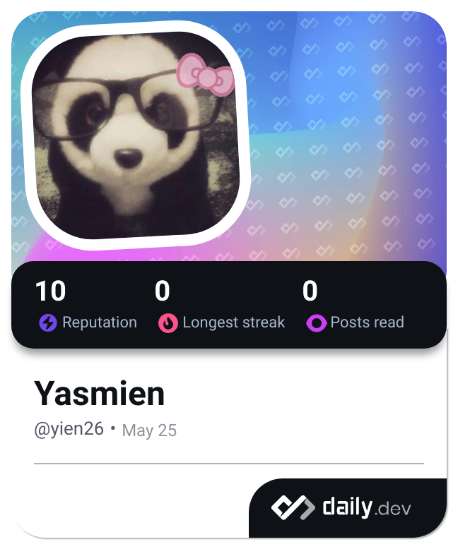

<a name="readme-top">

<br/>

<br />
<div align="center">
  <a href="https://github.com/zyx-0314/">
  <!-- TODO: If you want to add logo or banner you can add it here -->
    
  </a>
<!-- TODO: Change Title to the name of the title of your Project -->
  <h3 align="center">HANDS ON 2</h3>
</div>
<!-- TODO: Make a short description -->
<div align="center">
  HERO & CARDS
</div>

<br />

<!-- TODO: Change the zyx-0314 into your github username  -->
<!-- TODO: Change the WD-Template-Project into the same name of your folder -->


---

<br />
<br />

<!-- TODO: If you want to add more layers for your readme -->
<details>
  <summary>Table of Contents</summary>
  <ol>
    <li>
      <a href="#overview">Overview</a>
      <ol>
        <li>
          <a href="#key-components">Key Components</a>
        </li>
        <li>
          <a href="#technology">Technology</a>
        </li>
      </ol>
    </li>
    <li>
      <a href="#rule,-practices-and-principles">Rules, Practices and Principles</a>
    </li>
    <li>
      <a href="#resources">Resources</a>
    </li>
  </ol>
</details>

---

## Overview

<!-- TODO: To be changed -->
<!-- The following are just sample -->
What is the project?

The project is a website featuring 5 different hero designs, each represented by a static card and an animated card. These designs are unique in their visual presentation and animation styles, showcasing various fictional heroes or characters.

What's the purpose?

The purpose of the website is to highlight creativity in design and animation using HTML and CSS only. It serves as a showcase of skills in web development, particularly in creating visually appealing and interactive elements solely through front-end technologies.

Key Components

- Hero Designs: Each hero has a distinct visual design, portraying their unique characteristics and attributes.
- Static Cards: Static cards provide a snapshot of each hero's design, including their name, a brief description, and an image.
- Animated Cards: Animated cards showcase dynamic animations related to each hero, enhancing user engagement and visual appeal.
- Navigation: Navigation elements allow users to explore different heroes and their respective static and animated cards.
- Responsive Design: The website is responsive to ensure usability across various devices and screen sizes.

Technology Used and How It is Used

- HTML: Used for structuring the content of the website, including headings, paragraphs, images, and links.
- CSS: Used for styling the website, including layout, colors, fonts, animations, and responsive design techniques.

Specific Uses of Technology:
- Selectors and Styling: CSS selectors are used to target HTML elements and apply styles such as colors, fonts, margins, paddings, and borders to create visually appealing hero cards.
- Animations: CSS animations and transitions are employed to animate elements such as hover effects on hero cards, creating a more dynamic user experience.


### Key Components
<!-- TODO: List of Key Components -->
<!-- The following are just sample -->
- MultiPage Website: Consists of multiple HTML pages, each dedicated to different heroes or sections. Navigation typically includes links to different pages.

### Technology
<!-- TODO: List of Technology Used -->


## Rules, Practices and Principles
1. Always use `WD-` in the front of the Title of the Project for the Subject followed by your custom naming.
2. Do not rename any .html files; always use `index.html` as the filename.
3. Place Files in their respective folders.
4. All file naming are in camel case.
   - Camel case is naming format where there is no white space in separation of each words, the first word is in all lower case while the succeding words first letter are in upper followed by lower cased letters.
   - ex.: buttonAnimatedStyle.css
5. Use only `External CSS`.
6. Renaming of Pages folder names are a must, and relates to what it is doing or data it holding.
7. File Structure to follow below.

```
WD-ProjectName
└─ assets
|   └─ css
|   |   └─ style.css
|   └─ img
|   |   └─ fileWith.jpeg/.jpg/.webp/.png
|   └─ js
|       └─ script.js
└─ pages
|  └─ pageName
|     └─ assets
|     |  └─ css
|     |  |  └─ style.css
|     |  └─ img
|     |  |  └─ fileWith.jpeg/.jpg/.webp/.png
|     |  └─ js
|     |     └─ script.js
|     └─ index.html
└─ index.html
└─ readme.md
```

## Resources

<!-- TODO: Add References -->
| Title | Purpose | Link |
|-|-|-|
| Sample Title | Sample purpose would be here like this and this is the example of what it is. | trykolang.com |
